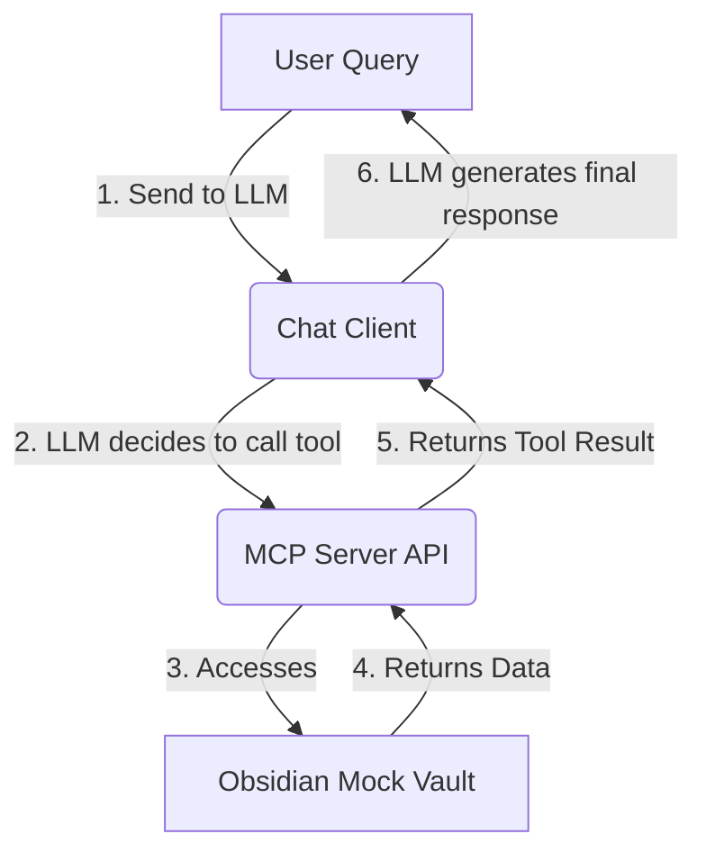

# System Architecture and Mock MCP API Design

The goal is to create a chat application that adheres to the user's provided System, Developer, and Tool policies for interacting with an Obsidian vault via a Model Context Protocol (MCP) server. Since a real-world connection to the user's vault is not possible, a mock environment will be established.

## 1. System Architecture

The application will consist of three main components, all implemented in Python, following best practices:

1.  **Obsidian Mock Vault**: A simple directory structure containing Markdown files (`.md`) to simulate the user's notes. This will be the "source of truth" for the system.
2.  **MCP Server (FastAPI)**: A lightweight web server that exposes a REST API to access the mock vault data. This server acts as the "access gate" and implements the functions required by the LLM's tool policy.
3.  **Chat Client (Python)**: A command-line application that manages the conversation. It will use the OpenAI API (or an equivalent LLM) with **tool-calling** capabilities, passing the MCP Server functions as available tools. It will strictly enforce the mandatory execution flow defined in the Developer Prompt.

## 2. Mock MCP API Specification

The MCP Server will expose the following endpoints, which will be defined as functions (tools) for the LLM to call.

| Tool Name (for LLM) | Endpoint | Method | Description | Parameters | Response Example |
| :--- | :--- | :--- | :--- | :--- | :--- |
| `list_vault_files` | `/api/v1/files` | `GET` | Lists all file paths in the vault. | `path: str` (optional, subdirectory) | `["Notes/Article_A.md", "Concepts/LLM.md"]` |
| `search_vault` | `/api/v1/search` | `GET` | Searches for content or tags across all notes. | `query: str` (text or tag), `type: str` (e.g., "content", "tag") | `[{"path": "...", "snippet": "..."}]` |
| `read_file_content` | `/api/v1/read` | `GET` | Reads the full content of a specific file. | `path: str` (file path) | `{"content": "..."}` |
| `get_file_metadata` | `/api/v1/metadata` | `GET` | Retrieves file metadata, including tags. | `path: str` (file path) | `{"name": "...", "tags": ["#llm", "#mcp"]}` |

This design ensures that the LLM's interaction with the "database" (Obsidian notes) is strictly mediated by the defined MCP interface, fulfilling the user's requirement to use MCP instead of RAG. The Chat Client will be responsible for injecting the System and Developer prompts into the LLM's context.
